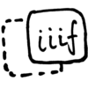

# IIIF Drag-and-drop demo

*WARNING* - Work in progress! User beware

## HTML pattern for drag and drop

The source page for drag and drop should include the standard IIIF logo wrapped in a hyperlink. The URI of the hyperlink provides a default target in case clicked by the user, followed by a dummy query string with the `manifest`, `canvas` or `image` `info.json` URIs used to implement the draf and drop. The default target could be a help page or perhaps open a particular viewer showing the image or manifest. The query parameters are:

  * `manifest` - URI of an IIIF Presentation API manifest.
  * `canvas` - URI of currently selected canvas within the manifest. If no `canvas` is specified then the target application will use its default behaviour to present the manifest. (Has no meaning unless `manifest` is given.)
  * `image` - URI of an IIIF Image API `info.json`. This is an alternative to specifying a `manifest` for use in situations where the source implements only the Image API.

HTML example:

```
<a href="default_target?manifest=manifest_URI&canvas=canvas_URI">
  
</a>
```

The dummy version of the propose *standard IIIF drag and drop logo* used for this demo is:


## Demo pages

Source page: <http://zimeon.github.io/iiif-dragndrop/>

Drop test: <http://zimeon.github.io/iiif-dragndrop/droptest.html>
